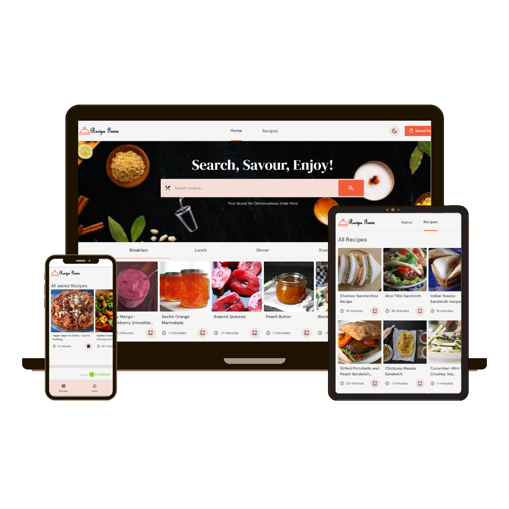
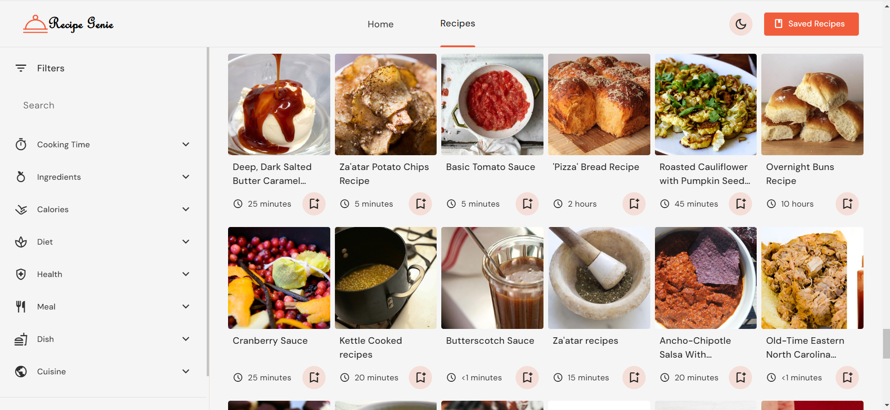
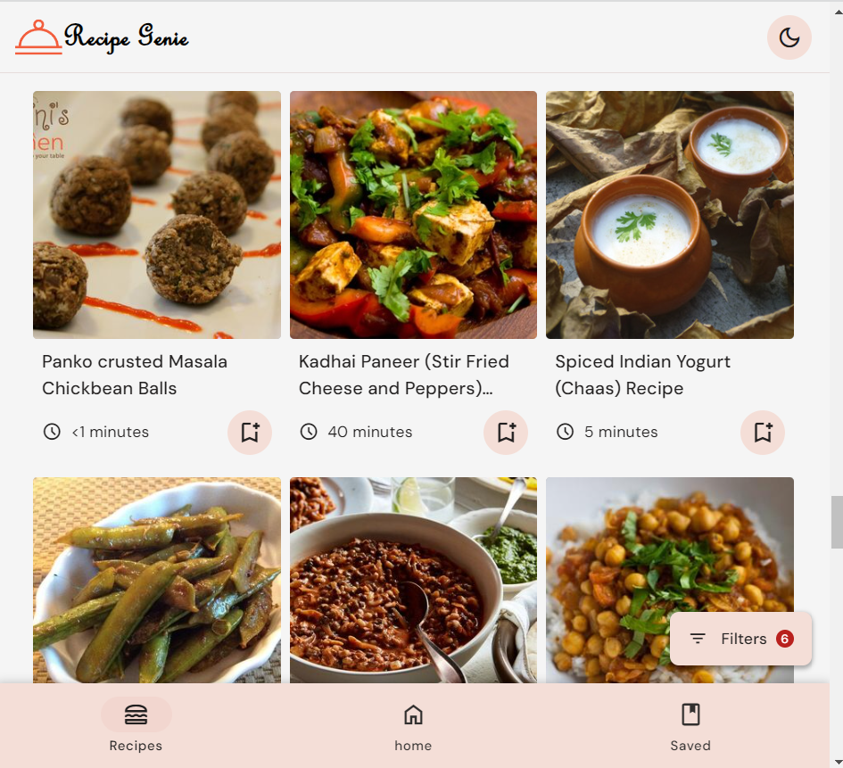
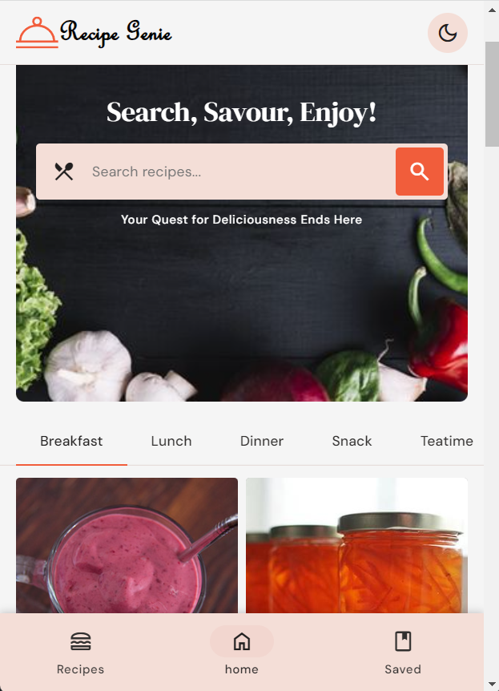

# **Recipe Genie**

---

## Project Overview

Recipe Genie is a responsive web application designed for finding delicious recipes tailored to your preferences. The project is built using HTML, CSS, and JavaScript, and it utilizes the Edamam API for fetching recipe data. With a user-friendly interface, it provides a variety of filters, allowing you to discover recipes based on specific criteria.

Additionally, it lets you save your favorite recipes for future reference, making it a convenient tool for both exploration and personal recipe collection.

<details>
  <summary><b>Table of Contents</b></summary>

  - [UX Development](#ux-development)
    - [Strategy](#strategy)
    - [User Stories](#user-stories)
  - [Tech Stack](#tech-stack)
  - [Visual Preview](#visual-preview)
  - [Local Deployment](#local-deployment)
  - [Credits](#credits)
  - [Acknowledgements](#acknowledgements)
</details>
<br>



---

# UX Development

## Strategy

### Project Goals
- Create a user-friendly recipe search platform.
- Allow users to filter recipes based on various criteria.
- Provide a visually appealing and responsive design for different devices.
- Utilize the Edamam API to fetch recipe data.

### User Demographic
- Individuals looking for specific recipes based on preferences.
- Cooking enthusiasts seeking diverse recipes.
- Users interested in healthy or dietary-specific recipes.
- Anyone who enjoys exploring various cuisines.

## User Stories
### First Time Visitor Goals
- Easily navigate through the application.
- Understand the purpose of the Recipe Genie.
- Explore different filters available for recipe search.

### Returning Visitor Goals
- Save favorite recipes for future reference.
- Quickly access previously saved recipes.
- Discover new recipes with different filters.

---

## Tech Stack


---

 # Visual Preview
 <br>

| <video width="100%" controls autoplay loop><source src="assets/videos/v1.mp4" type="video/mp4">Your browser does not support the video tag.</video> | <video width="100%" controls autoplay loop><source src="assets/videos/v2.mp4" type="video/mp4">Your browser does not support the video tag.</video> |
|-------------------------------------------------------------------------------------------------------------------------------------------|-------------------------------------------------------------------------------------------------------------------------------------------|

<br>


| **Responsive Design** |
| ----------------- |
|    |


---

# Local Deployment

To run locally, follow these steps:

1. **Clone the repository:**
    ```bash
    git clone https://github.com/your-username/RecipeGenie-MealExplorer.git
    ```

2. **Navigate to the project directory:**
    ```bash
    cd RecipeGenie-MealExplorer
    ```

3. **Get your own API keys** for the Edamam API referenced below and update them in the `api.js` file.

4. **Open the `index.html` file in your preferred browser.**

---

# Credits

**Code:**
- The structure and implementation of the Edamam API integration were inspired by various examples and documentation.

**Resources:**
- [Edamam API](https://developer.edamam.com/)

---

# Acknowledgements

A special thanks to the Edamam API for providing a rich database of recipes. Thanks to my mentors for their guidance and support.

---

**&copy; 2023 Recipe Genie by Khushi**

